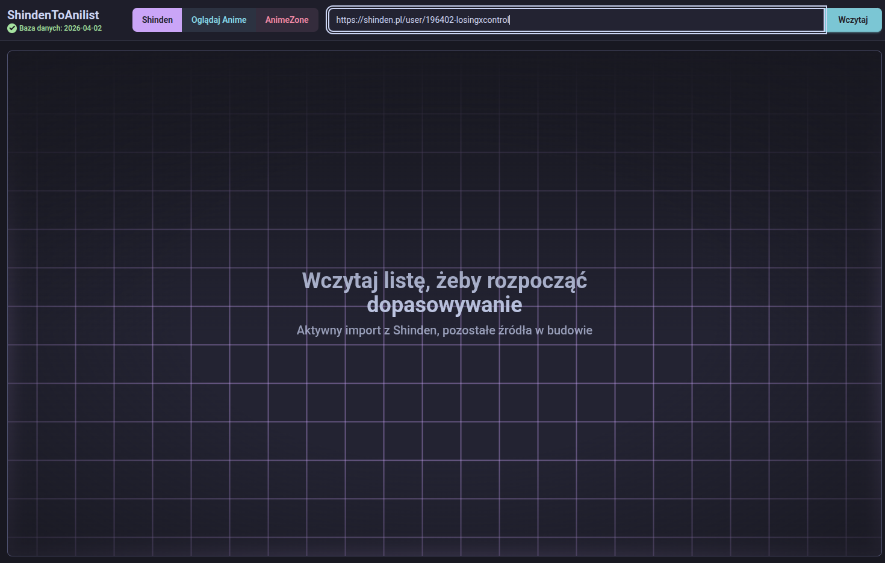
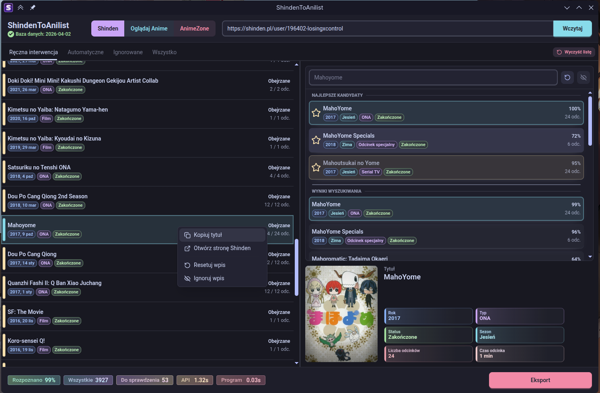

# ShindenToAnilist

> Eksportuj swoją listę z Shindena do pliku XML, który zaimportujesz do AniList albo MyAnimeList.

**ShindenToAnilist** to aplikacja desktopowa dla osób, które prowadzą swoją listę anime na
[Shindenie](https://shinden.pl), AnimeZone albo Oglądaj Anime i chcą przenieść ją do serwisów takich jak
[AniList](https://anilist.co/settings/import) albo [MyAnimeList](https://myanimelist.net/import.php).

Aplikacja pozwala
przejrzeć lub ręcznie poprawić niepewne dopasowania, a na końcu zapisuje eksport XML zgodny z MAL.

## Zrzuty ekranu

<table>
  <tr>
    <td>
      
    </td>
    <td>
      
    </td>
  </tr>
</table>

## Wydania

Gotowe paczki aplikacji są publikowane na stronie wydań:

<https://github.com/Kacper-Kondracki/ShindenToAnilist/releases>

> [!NOTE]
> W porównaniu ze starszą wersją nacisk jest
> położony na szybsze dopasowywanie tytułów, wygodniejszy interfejs desktopowy i ręczną korektę
> niepewnych wyników. Wprowadzono zupełnie nowy algorytm znajdujący dopasowania, zoptymalizowany pod wielowątkowość i dostrojony by automatycznie znajdował dokladnie jak najwięcej tytułów. Nikt nie lubi ręcznie męczyć się z tym :)

## Co robi aplikacja

1. Wczytuje listę anime z wybranego źródła: Shinden, AnimeZone albo Oglądaj Anime.
2. Pobiera i zapisuje lokalną bazę używaną do dopasowywania tytułów.
3. Automatycznie szuka najlepiej pasującę tytuły w bazie.
4. Pokazuje dopasowania i listę kandydatów.
5. Pozwala ręcznie wybrać lepsze dopasowanie, gdy automatyczny wynik nie wystarcza.
6. Eksportuje wybrane dopasowania do pliku XML.

> [!IMPORTANT]
> Wczytywanie list działa dla Shindena, AnimeZone i Oglądaj Anime. AnimeZone oraz Oglądaj Anime są
> pobierane przez scrapowanie stron, więc są wolniejsze niż Shinden; Oglądaj Anime ma też ostre limity
> zapytań. Aplikacja wyciąga bezpośrednie linki do MAL-a tam, gdzie źródło je udostępnia, co powinno
> znacząco ograniczyć ręczne dopasowywanie.

## Import eksportu

Po wyeksportowaniu XML-a z aplikacji zaimportuj go na jednej z tych stron:

- AniList: <https://anilist.co/settings/import>
- MyAnimeList: <https://myanimelist.net/import.php>

## Dla developerów

Instrukcje deweloperskie znajdują się tu
[CONTRIBUTING.md](CONTRIBUTING.md). Opis granic modułów jest w [ARCHITECTURE.md](ARCHITECTURE.md).

## Licencja

Projekt jest dostępny na licencji [Mozilla Public License 2.0](LICENSE).
